# WEB STACK IMPLEMENTATION (LAMP STACK) IN AWS
---

### *Instrustions on seting up a LAMP STACK in AWS*

**Table of contents:**

    
1. [Provisioning Linux (Ubuntu) server in AWS EC2 instance](#provisioning-linux-ubuntu-server-in-aws-ec2-instance)

2. [Instaling APACHE and Updating THE FIREWALL](#instaling-apache-and-updating-the-firewall)

3. [Installing MYSQL](#installing-mysql)

4. [Installing PHP](#installing-php)

5. [Create a Virtual Host for the Website using APACHE](#creating-a-virtual-host-for-your-website-using-apache)

6. [Enable PHP on the WEBSITE](#enable-php-on-the-website)

7. [Links](#links)
  
----
---
### **Provisioning Linux (Ubuntu) server in AWS EC2 instance**
---
**Provisioning an Ubuntu Serve in AWS EC2 Instance.**

- *AWS account setup and Provisioning an Ubuntu Server*


    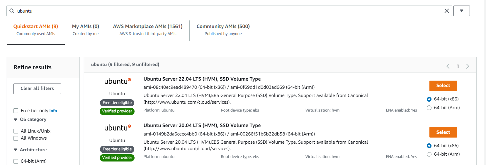

    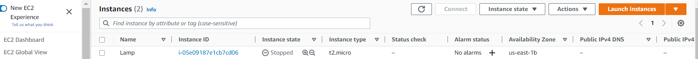


- Connecting to your EC2 Instance

ssh into the Ec2 instance: `ssh -i "private_key.pem" ubuntu@Public DNS`

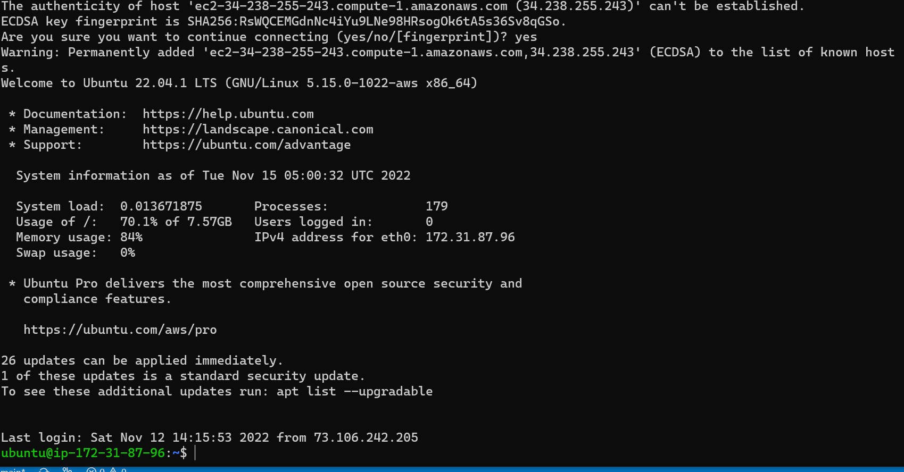

---
---
### **Instaling APACHE and Updating THE FIREWALL**
-----

Install Apache using Ubuntu’s package manager `apt`:

``` py
#update a list of packages in package manager#
sudo apt update

#run apache2 package installation#
sudo apt install apache2
```

To verify that apache2 is running as a Service in our OS, use following command

`sudo systemctl status apache2`

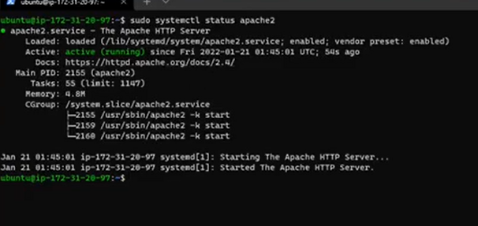

*Updating the security group Configuration by openning port 80*

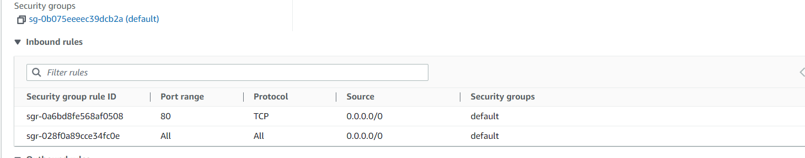


 Checking the access locally in our Ubuntu shell,:
```py
 curl http://localhost:80
or

 curl http://127.0.0.1:80
```

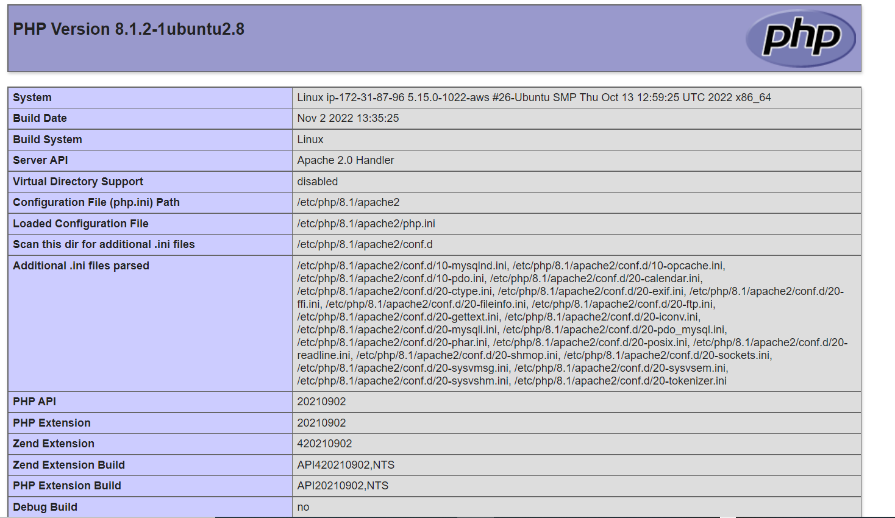


---
---
### **Installing MYSQL**
---

Again, use ‘apt’ to acquire and install this software:

`$ sudo apt install mysql-server`

When the installation is finished, log in to the MySQL console by typing:

`$ sudo mysql`


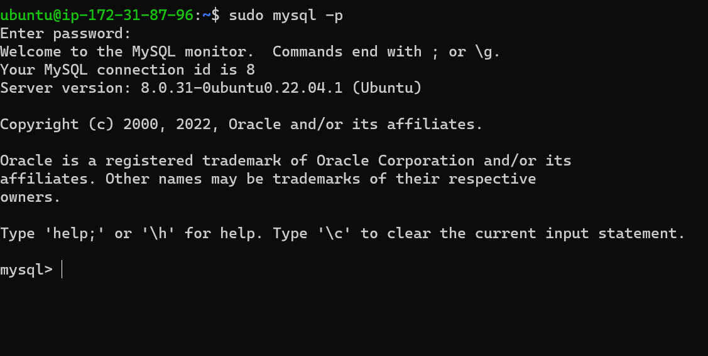


Run the security script:

`$ sudo mysql_secure_installation`

Testing the security setting by runing:

`$ sudo mysql -p`

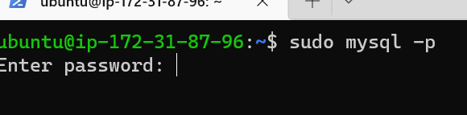

---
---
### **Installing PHP**

---

 *In addition to php package we'll need:*
 * `php-mysql`, a PHP module that allows PHP to communicate with MySQL-based databases
  
  * `libapache2-mod-php` to enable Apache to handle PHP files.
  
  To install these 3 packages at once, run:

`sudo apt install php libapache2-mod-php php-mysql`

Once the installation is finished, you can run the following command to confirm your PHP version:

`php -v`

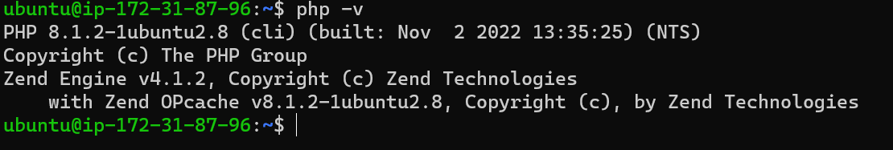

---
---
### **Creating a Virtual Host for YOUR Website using APACHE**
---
  1_ Create the directory for projectlamp using ‘mkdir’ command as follows:

`sudo mkdir /var/www/projectlamp`

2_ Assign ownership of the directory with your current system user:

 `sudo chown -R $USER:$USER /var/www/projectlamp`

 3_ Create and open a new configuration file in Apache’s **sites-available** directory using your `Vim` command-line editor

 `
 sudo vi /etc/apache2/sites-available/projectlamp.conf`

 This will create a new blank file. Paste in the following bare-bones configuration by hitting on i on the keyboard to enter the insert mode, and paste the text:

```
 <VirtualHost *:80>
    ServerName projectlamp
    ServerAlias www.projectlamp 
    ServerAdmin webmaster@localhost
    DocumentRoot /var/www/projectlamp
    ErrorLog ${APACHE_LOG_DIR}/error.log
    CustomLog ${APACHE_LOG_DIR}/access.log combined
</VirtualHost>
```


Confirming with `ls` commande

`sudo ls /etc/apache2/sites-available`

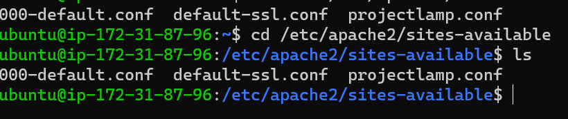

use a2ensite command to enable the new virtual host:

`sudo a2ensite projectlamp`

run:
`sudo apache2ctl configtest` to check the config file for error

Finally, reload Apache so these changes take effect:

`sudo systemctl reload apache2`

Create an index.html file in the web root /var/www/projectlamp directory to test the virtual host.

```py
sudo echo 'Hello LAMP from hostname' $(curl -s http://169.254.169.254/latest/meta-data/public-hostname) 'with public IP' $(curl -s http://169.254.169.254/latest/meta-data/public-ipv4) > /var/www/projectlamp/index.html
```

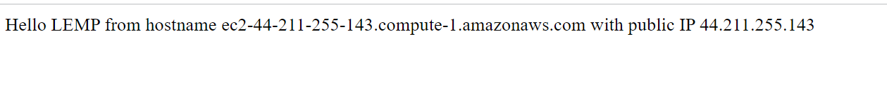

---
---

### **Enable PHP on the WEBSITE**
---
Edit the /etc/apache2/mods-enabled/dir.conf file and change the order in which the index.`php` file is listed within the DirectoryIndex directive:

`sudo vim /etc/apache2/mods-enabled/dir.conf`
```py
<IfModule mod_dir.c>
        #Change this:
        #DirectoryIndex index.html index.cgi index.pl index.php index.xhtml index.htm
        #To this:
        DirectoryIndex index.php index.html index.cgi index.pl index.xhtml index.htm
</IfModule>
```

After saving and closing the file, you will need to reload Apache so the changes take effect:

`sudo systemctl reload apache2`

Finally, we will create a PHP script to test that PHP is correctly installed and configured on your server.


Create a new file named `index.php` inside your custom web root folder:

`vim /var/www/projectlamp/index.php`

This will open a blank file. Add the following text, which is valid PHP code, inside the file:

```
<?php
phpinfo();
```


---
---

### **Links**
---
[Install Open ssh Server][https://learn.microsoft.com/en-us/windows-server/administration/openssh/openssh_install_firstuse?tabs=gui]

[Open ssh key management](https://learn.microsoft.com/en-us/windows-server/administration/openssh/openssh_keymanagement?source=recommendations)

[Markdown guide][https://www.markdownguide.org/cheat-sheet/]
