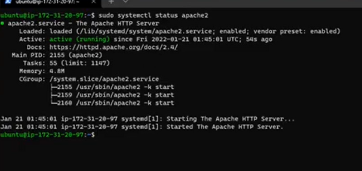

## Documentation of Project 1

`sudo apt update`

`sudo apt install apache2`

`sudo systemctl apache2`

[Install Open ssh Server][https://learn.microsoft.com/en-us/windows-server/administration/openssh/openssh_install_firstuse?tabs=gui]

[Open ssh key management](https://learn.microsoft.com/en-us/windows-server/administration/openssh/openssh_keymanagement?source=recommendations)

[Markdown guide](https://www.markdownguide.org/cheat-sheet/)

[def]: https://learn.microsoft.com/en-us/windows-server/administration/openssh/openssh_install_firstuse?tabs=gui